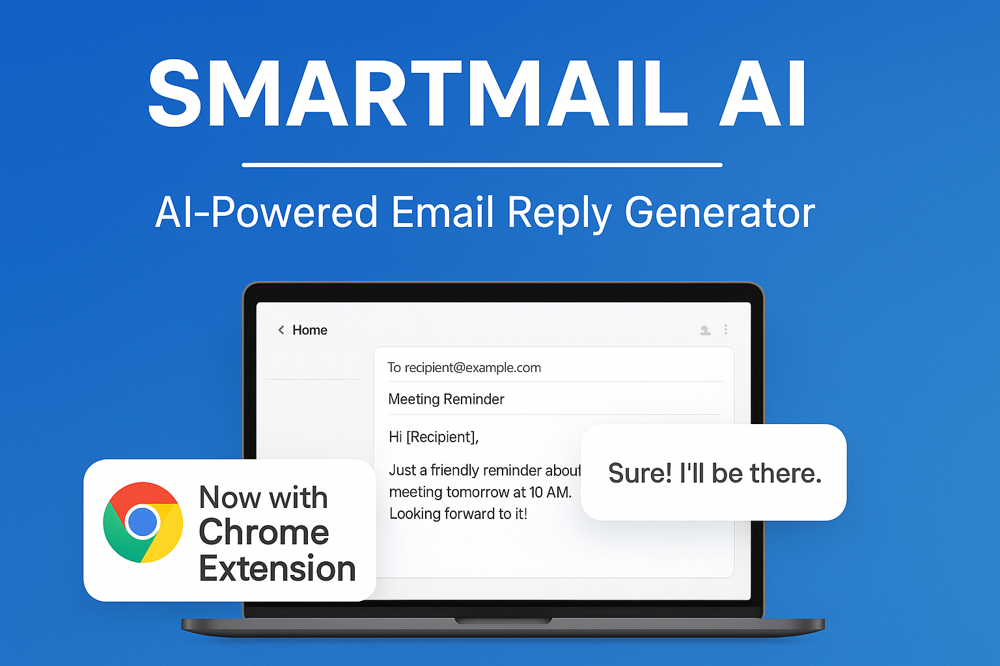

# SmartMail-AI




SmartMail AI is an **AI-powered email assistant** that helps professionals generate **smart, structured, and context-aware email replies** instantly.  
Built with **Spring Boot**, **React.js**, and a **Chrome Extension**, this project leverages **Google Gemini API** to make communication faster and smarter.


---

## ✨ Features
- ⚡ **Spring Boot Backend** – Secure and scalable backend with REST APIs.
- 🌐 **React.js Frontend** – Modern UI for seamless interaction.
- 🧩 **Chrome Extension** – Direct integration with Gmail for one-click smart replies.
- 🤖 **AI-Powered Replies** – Context-aware responses using Google Gemini API.
- 📩 **SMTP/IMAP Support** – Compatible with multiple email providers.
- 🔐 **Secure Communication** – API keys and credentials safely managed.

---


## 🛠️ Tech Stack
- **Backend:** Spring Boot (Java), REST APIs
- **Frontend:** React.js, Tailwind CSS
- **Extension:** Chrome Extension (JavaScript)
- **AI Integration:** Google Gemini API
- **Deployment:** Render (Backend), Vercel (Frontend)

---

## 🚀 Getting Started

1️⃣ Clone Repository
```
git clone https://github.com/KiranBhad/SmartMail-AI.git
cd SmartMail-AI
```
2️⃣ Setup Backend (Spring Boot)
```
cd backend
./mvnw spring-boot:run
```
3️⃣ Setup Frontend (React)
```
cd frontend
npm install
npm run dev
```
4️⃣ Load Chrome Extension

  1.Go to chrome://extensions/

  2.Enable Developer Mode

  3.Click Load Unpacked

  4.Select the extension/ folder


  👤 Author
   -Kiran Bhad
  ✉️ bhadkiran1804@gmail.com
  🔗 https://www.linkedin.com/in/kiran-bhad-9458b1236/
  📞9011899285
    
